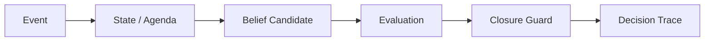

# Companion-Mind

**Runtime layer for state, provenance, closure guards, and decision traces in long-running LLM workflows.**

[](https://github.com/aerenkolstein-code/Companion-Mind/actions/workflows/test.yml)

## First Closed Loop

| Result | Measured value |
|---|---:|
| Baseline accuracy | 20% |
| With Closure Guard | 100% |
| Known regression failures caught | 4/4 |
| Runtime tests | 7/7 |

**Status:** Experimental / reproducible artifact  
**Evidence level:** E3 — executable, tested prototype



Companion-Mind implements the protection. The paired [LLM Evaluation Lab](https://github.com/aerenkolstein-code/llm-evaluation-lab) tests whether that protection works.

`CM-GUARD-001` addresses **Premature Parent Closure**: a parent goal must not be marked `DONE` while any required child remains open, unknown, waiting, blocked, or pending. The guard reads structured child state before permitting the write.

> In the current reproducible first-closed-loop evaluation, the implemented Closure Guard improved the tested cases from 20% baseline accuracy to 100%; broader generalization has not yet been established.

## Reproduce

Requires Python 3.11 or later. No API key or third-party runtime dependency is required.

```bash
python -m pip install -e .
python -m unittest discover -s tests -v
python -m companion_mind.runtime
```

## Evidence boundary

### Implemented

- minimal event-to-state runtime;
- persistent state and active agenda separated from prose;
- provenance-bearing `BeliefCandidate` and `DecisionTrace` records;
- `CM-GUARD-001` Closure Guard;
- duplicate-event suppression and per-event task budget;
- shared public `EvaluationCase` schema.

### Measured in the current demonstration

- baseline accuracy: **20%**;
- guarded accuracy: **100%**;
- premature closure rate: **100% → 0%**;
- known recurrence variants caught: **4/4**;
- runtime unit tests: **7/7**.

### Not claimed

- production deployment;
- broad model generalization;
- scientific benchmark validity;
- enterprise-grade reliability;
- autonomous cognition or consciousness.

## Repository map

- `companion_mind/models.py` — observable runtime contracts
- `companion_mind/runtime.py` — runtime loop and `CM-GUARD-001`
- `tests/test_runtime.py` — safeguard and state-transition tests
- `schemas/evaluation_case.schema.json` — shared evaluation contract
- `docs/history/README.md` — audited Gen1 migration ledger

## Privacy

Only synthetic, public-safe events and traces are used. The repository contains no private Raw/L0 material, credentials, account data, client documents, personal records, or links to private archives.

