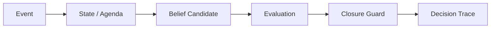

# Companion-Mind

**Runtime layer for state, provenance, closure guards, and decision traces in long-running LLM workflows.**

[](https://github.com/aerenkolstein-code/Companion-Mind/actions/workflows/test.yml)

## First Closed Loop

| Result | Measured value |
|---|---:|
| Baseline accuracy | 20% |
| With Closure Guard | 100% |
| Known regression failures caught | 4/4 |
| Runtime tests | 32/32 |
| Live / replay snapshot | Exact match |
| MitigationSpec contract | Validated + fingerprinted |

**Status:** Experimental / reproducible artifact  
**Evidence level:** E3 — executable, tested prototype



Companion-Mind implements the protection. The paired [LLM Evaluation Lab](https://github.com/aerenkolstein-code/llm-evaluation-lab) tests whether that protection works.

`CM-GUARD-001` addresses **Premature Parent Closure**: a parent goal must not be marked `DONE` while any required child remains open, unknown, waiting, blocked, or pending. The guard reads structured child state before permitting the write.

> In the current reproducible first-closed-loop evaluation, the implemented Closure Guard improved the tested cases from 20% baseline accuracy to 100%; broader generalization has not yet been established.

## Reproduce

Requires Python 3.12 or later. The declared validation dependencies install
with the package; no API key is required for the current reproducible demos or
the provider-free persona skeleton.

```bash
python -m pip install -e .
python -m unittest discover -s tests -v

event_dir="$(mktemp -d)"
companion-mind demo --event-log "$event_dir/events.jsonl" > "$event_dir/live.json"
companion-mind replay --event-log "$event_dir/events.jsonl" > "$event_dir/replayed.json"
cmp "$event_dir/live.json" "$event_dir/replayed.json"
```

The demo writes five synthetic events, blocks the first closure request while a
required agenda item is open, accepts closure after that item becomes terminal,
and then proves that a clean replay reconstructs the same state and traces.

## Executable MitigationSpec v0.3

The runtime can now load the JSON contract emitted by LLM Evaluation Lab. It
validates the schema version, target failure, guard type, decision mapping and
status sets before registering `CM-GUARD-001`. Unsupported or ambiguous specs
fail closed. A canonical SHA-256 fingerprint is included in runtime snapshots so
the evaluation report can prove which configuration actually ran.

```bash
llm-eval --emit-mitigation /tmp/mitigation.json --output /tmp/evaluation.json
companion-mind validate-mitigation --mitigation-spec /tmp/mitigation.json
companion-mind demo --mitigation-spec /tmp/mitigation.json
```

## LIN-ZHIYAO Runtime v0.2 — Step 01

The repository now includes the provider-independent skeleton for the
cross-model persona-continuity experiment. `LIN-ZHIYAO` is loaded from a
strict, manually maintained persona document; a runtime session owns persona,
relationship, conversation, and session state; and the validated state is
persisted locally before any model adapter exists.

```python
from companion_mind import Runtime

runtime = Runtime(personas_dir="personas", state_dir="data/state")
state = runtime.start_session(persona_id="LIN-ZHIYAO")
print(state.session.session_id)
print(state.persona.persona_id)
```

This step does **not** connect DeepSeek, Grok, or any other provider. It does
not claim cross-model continuity. Provider adapters, handoff, return, routing,
and blind evaluation remain later gated steps.

## Evidence boundary

### Implemented

- typed event-to-state contracts;
- append-only, fsynced JSONL event persistence;
- state-backed active agenda separated from prose;
- deterministic replay of state, agenda, deltas, and decision traces;
- validated `mitigation-spec/v1` loading and canonical fingerprinting;
- spec-configured Closure Guard registration;
- provenance-bearing `BeliefCandidate` and `DecisionTrace` records;
- `CM-GUARD-001` Closure Guard;
- duplicate-event suppression and per-event task budget;
- shared public `EvaluationCase` schema.

### Measured in the current demonstration

- baseline accuracy: **20%**;
- guarded accuracy: **100%**;
- premature closure rate: **100% → 0%**;
- known recurrence variants caught: **4/4**;
- runtime unit tests: **32/32**;
- live snapshot versus clean replay: **exact match**;
- replayed public demo events: **5/5**.

### Not claimed

- production deployment;
- transactional database durability;
- broad model generalization;
- scientific benchmark validity;
- enterprise-grade reliability;
- autonomous cognition or consciousness.

## Repository map

- `companion_mind/models.py` — observable runtime contracts
- `companion_mind/runtime.py` — event store, MitigationSpec loader, runtime, replay CLI, and guard
- `tests/test_runtime.py` — contract, safeguard, persistence, replay, and state tests
- `schemas/evaluation_case.schema.json` — shared evaluation contract
- `docs/history/README.md` — audited Gen1 migration ledger

## Privacy

Only synthetic, public-safe events and traces are used. The repository contains no private Raw/L0 material, credentials, account data, client documents, personal records, or links to private archives.
