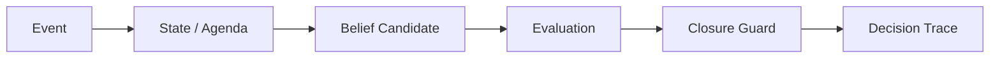

# Companion-Mind

**Runtime layer for state, provenance, closure guards, and decision traces in long-running LLM workflows.**

[](https://github.com/aerenkolstein-code/Companion-Mind/actions/workflows/test.yml)

## Production-line model

The project uses **production-line names**, not repository aliases.

### Core production lines

- **A1 — Build Line.** The primary Companion-Mind system-development line. A1 builds the runtime and its durable state, context, retrieval, continuity, model-adaptation, and owned-client capabilities.
- **A2 — Companion Evaluation Line.** A1's independent companion-evaluation line. A2 exists where an explicit A1 milestone must wait for independent evaluation evidence before A1 can proceed, revise, roll back, or hold. A typical dependency is `A1 candidate → WAIT-A2 → A2 evidence → A1 decision`.

> **A1 builds. A2 independently verifies when A1 needs evidence before proceeding.**

### Other workstreams

- **B — Independent Evaluation Line.** Evaluation work that can stand on its own without becoming an A1 gate. Search Cup is one B-line project; B is not synonymous with Search Cup.
- **C1 / C2 — Tooling Lines.** Engineering-tool lines that build tools for the construction and operation of the Companion-Mind and LLM Evaluation Lab repositories. Their current tools do not define the lines themselves.

Repository placement does not define line identity. Companion-Mind primarily hosts A1 implementation artifacts and may also host tooling or cross-line artifacts when appropriate. The paired [LLM Evaluation Lab](https://github.com/aerenkolstein-code/llm-evaluation-lab) hosts A2 evidence and B-line evaluation work. **Line defines responsibility and dependency; repository defines where artifacts live.**

## Current engineering focus

The current A1 product-engineering sequence follows a **personal-first owned-runtime path**. It is intentionally narrower than a commercial product roadmap: first make state and history durable, then build an owned client/runtime that can assemble context, retrieve the right authority, adapt to different model capabilities, and support long-running real work without depending on a vendor chat UI.

**Phase 0 — Canonical Event & Runtime Boundary Contract v1** has landed on `main` and Gate P0 is GREEN. It freezes the shared event contract and ownership boundary for Journal / Current / Memory / Persona-Relationship state. **Phase 1 — Durable Journal** is the next gated engineering increment and is **not claimed as implemented here**.

After a future Durable Journal / E1 gate, the public roadmap moves toward owned-client foundations: local client shell, context assembly, retrieval/authority routing, model gateway/capability adaptation, and auditable context/tool traces. Only after sustained longitudinal dogfooding would productization be reconsidered from evidence; the repository does not currently claim a commercial Alpha, billing path, or fixed commercial product shape.

Separately, the bounded read-only **C2 long-conversation recovery prototype** has landed on `main`. It can recover an already-hydrated ChatGPT Web conversation graph locally, checksum the artifact, and reconcile it against a renderable-turn ledger while leaving residual gaps explicit. This is an experimental browser-forensics/recovery artifact, **not** a production ChatGPT integration or a supported OpenAI API. C2 is a tooling line; this recovery prototype is one C2 project, not the definition of C2 itself.

The `main` branch remains the stable, reproducible **First Closed Loop** artifact plus the published Phase 0 contract and accepted C2 prototype. Durable Journal and higher owned-runtime/client work remain future gated increments, not completion claims.

[Read the current public-safe roadmap](docs/current-roadmap.md).

## First Closed Loop

| Result | Measured value |
|---|---:|
| Baseline accuracy | 20% |
| With Closure Guard | 100% |
| Known regression failures caught | 4/4 |
| Runtime tests | 22/22 |
| Live / replay snapshot | Exact match |
| MitigationSpec contract | Validated + fingerprinted |

**Status:** Experimental / reproducible artifact  
**Evidence level:** E3 — executable, tested prototype



Companion-Mind implements the protection. At this milestone, the paired [LLM Evaluation Lab](https://github.com/aerenkolstein-code/llm-evaluation-lab) supplies the independent A2 evidence used to test whether that protection works.

`CM-GUARD-001` addresses **Premature Parent Closure**: a parent goal must not be marked `DONE` while any required child remains open, unknown, waiting, blocked, or pending. The guard reads structured child state before permitting the write.

> In the current reproducible first-closed-loop evaluation, the implemented Closure Guard improved the tested cases from 20% baseline accuracy to 100%; broader generalization has not yet been established.

## Engineering case study — long-conversation recovery

A read-only browser-forensics investigation started with a ChatGPT conversation whose print preview was roughly **6,394 pages** and whose virtualized UI could take tens of seconds to materialize one long answer.

The investigation traced data through Network telemetry, virtualized DOM, React turn identity, browser storage, React Fiber, and React Query. In the decisive residency check, only **56** text-like turns were materialized in the DOM while **3,486 / 3,486** offscreen text-like nodes already carried non-empty payloads in the in-memory conversation graph.

The accepted bounded prototype then converted that finding into a local read-only exporter/verifier/reconciler:

```text
6,394-page UI
→ 3,529 renderable-turn ledger
→ 3,775-node conversation mapping
→ 3,719-node active path
→ bulk local export + deterministic checksum
→ role + timestamp + monotonic-order reconciliation
→ 3,523 matched / 5 missing / 196 extra / 1 ambiguous
→ targeted UI backfill only for explicit residual gaps
```

The accepted first-prototype gate explicitly did **not** require zero gaps. The final unresolved set is **6 items (5 missing + 1 ambiguous)** and remains known rather than silently backfilled.

[Read the current public-safe case study](docs/case-studies/chatgpt-long-conversation-recovery.md) · [Read the original investigation notes](docs/case-studies/chatgpt-long-conversation-recovery-investigation-notes.md) · [Completed implementation tracker](https://github.com/aerenkolstein-code/Companion-Mind/issues/10) · [Merged implementation PR #15](https://github.com/aerenkolstein-code/Companion-Mind/pull/15)

## Reproduce

Requires Python 3.11 or later. No API key or third-party runtime dependency is required for the First Closed Loop demo.

```bash
python -m pip install -e .
python -m unittest discover -s tests -v

event_dir="$(mktemp -d)"
companion-mind demo --event-log "$event_dir/events.jsonl" > "$event_dir/live.json"
companion-mind replay --event-log "$event_dir/events.jsonl" > "$event_dir/replayed.json"
cmp "$event_dir/live.json" "$event_dir/replayed.json"
```

The demo writes five synthetic events, blocks the first closure request while a required agenda item is open, accepts closure after that item becomes terminal, and then proves that a clean replay reconstructs the same state and traces.

## Executable MitigationSpec v0.3

The runtime can load the JSON contract emitted by LLM Evaluation Lab. It validates the schema version, target failure, guard type, decision mapping and status sets before registering `CM-GUARD-001`. Unsupported or ambiguous specs fail closed. A canonical SHA-256 fingerprint is included in runtime snapshots so the evaluation report can prove which configuration actually ran.

```bash
llm-eval --emit-mitigation /tmp/mitigation.json --output /tmp/evaluation.json
companion-mind validate-mitigation --mitigation-spec /tmp/mitigation.json
companion-mind demo --mitigation-spec /tmp/mitigation.json
```

## Evidence boundary

### Implemented

- typed event-to-state contracts;
- append-only, fsynced JSONL event persistence;
- state-backed active agenda separated from prose;
- deterministic replay of state, agenda, deltas, and decision traces;
- validated `mitigation-spec/v1` loading and canonical fingerprinting;
- spec-configured Closure Guard registration;
- provenance-bearing `BeliefCandidate` and `DecisionTrace` records;
- `CM-GUARD-001` Closure Guard;
- duplicate-event suppression and per-event task budget;
- shared public `EvaluationCase` schema.

### Measured in the current demonstration

- baseline accuracy: **20%**;
- guarded accuracy: **100%**;
- premature closure rate: **100% → 0%**;
- known recurrence variants caught: **4/4**;
- runtime unit tests: **22/22**;
- live snapshot versus clean replay: **exact match**;
- replayed public demo events: **5/5**.

### Not claimed

- production deployment;
- transactional database durability;
- broad model generalization;
- scientific benchmark validity;
- enterprise-grade reliability;
- autonomous cognition or consciousness.

## Repository map

- `companion_mind/models.py` — observable runtime contracts
- `companion_mind/runtime.py` — event store, MitigationSpec loader, runtime, replay CLI, and guard
- `companion_mind/chatgpt_recovery.py` — C2 fail-closed recovery verification and reconciliation helpers
- `tools/chatgpt_recovery_exporter.js` — local read-only browser exporter for the accepted C2 prototype
- `tests/test_runtime.py` — contract, safeguard, persistence, replay, and state tests
- `schemas/evaluation_case.schema.json` — shared evaluation contract
- `docs/current-roadmap.md` — public-safe current product-engineering sequence and non-claims
- `docs/case-studies/chatgpt-long-conversation-recovery.md` — current public-safe C2 case study and accepted outcome
- `docs/case-studies/chatgpt-long-conversation-recovery-investigation-notes.md` — original pre-implementation forensic investigation record
- `docs/history/README.md` — audited Gen1 migration ledger

## Privacy

Only synthetic, public-safe events and traces are used. The repository contains no private Raw/L0 material, credentials, account data, client documents, personal records, or links to private archives. The C2 public evidence reports structural counts, checksums, typed failures, and reconciliation status; recovered private conversation bodies remain outside the public repository.
