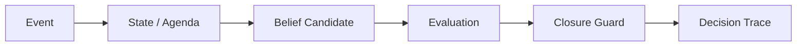

# Companion-Mind

**面向长期 LLM 工作流的状态、来源链、闭环保护与决策轨迹 Runtime。**

Portfolio Status：**CURRENT ARTIFACT** · Evidence Level：**E3——可运行、已测试的实验性原型**

## 当前工程主线

Companion-Mind 是 **A1 / Build the system** 仓库，当前采用 **personal-first owned-runtime / 先建自己的家** 路线。

眼下的产品工程顺序故意比商业产品路线更窄：先让“发生过什么”拥有可靠、可恢复的持久证据，再建设属于自己的客户端 / Runtime，让它能够按目标模型的能力组装正确上下文、检索正确 Authority、切换不同模型，并在不依赖某一个厂商聊天网页的情况下支持长期真实工作与生活。

**Phase 0｜Canonical Event & Runtime Boundary Contract v1** 已进入 `main`，Gate P0 = **GREEN**。它冻结了 Journal / Current / Memory / Persona-Relationship State 的共享事件合同与 Authority 边界；**Phase 1｜Durable Journal** 是下一道受 Gate 控制的工程增量，当前 README **不声称它已经实现**。

未来只有在 Durable Journal / Gate E1 明确 GREEN 后，公开工程路线才继续进入 Owned Home 基础：本地薄客户端、Context Engine、Retrieval / Authority Router、Model Gateway / Capability Registry，以及可审计的 context / retrieval / tool traces。再经过长期 personal dogfooding / Living Lab，才根据真实证据重新判断是否值得抽取商业产品；当前仓库**不宣称已经存在商业 Alpha、Billing 路径或预先确定的商业产品形态**。

当前公开路线详见：[docs/current-roadmap.md](docs/current-roadmap.md)。

配套的 [LLM Evaluation Lab](https://github.com/aerenkolstein-code/llm-evaluation-lab) 是 **A2 / Measure the system** 仓：

> **A1 builds the system. A2 measures whether it actually improves.**

## 当前阶段结构

```text
Phase 0 — Canonical Event / Runtime Boundary Contract     GREEN on main
        ↓
Phase 1 — Durable Journal / local canonical persistence  next gated increment
        ↓
Owned Home / owned-client foundation                     after explicit E1 GREEN
        ↓
Longitudinal personal dogfooding / Living Lab            real work + real failures
        ↓
Productization readiness                                 evidence-based decision
        ↓
Optional commercial product discovery                    only if evidence justifies it
```

几个必须继续成立的边界：

```text
Journal != Current != Memory != Persona / Relationship Authority
```

基础模型是可替换的 cognition provider。换模型、换 provider、换 context window，不能自动意味着换人物、换历史、换关系或换状态 Authority。

如果目标模型装不下所有上下文，Runtime 应让压缩、遗漏和检索决策可追踪，而不是静默截断必须到场的证据。

## First Closed Loop

`CM-GUARD-001` 针对 **Premature Parent Closure**：父目标仍有 `OPEN`、`UNKNOWN`、等待、阻塞或待处理的必需子任务时，不允许把父目标写成 `DONE`。

| 结果 | 实测值 |
|---|---:|
| Baseline accuracy | 20% |
| With Closure Guard | 100% |
| Known regression failures caught | 4/4 |
| Runtime tests | 22/22 |
| Live / replay snapshot | Exact match |
| MitigationSpec contract | Validated + fingerprinted |

**Status:** Experimental / reproducible artifact  
**Evidence level:** E3 — executable, tested prototype



Companion-Mind 实现保护机制；LLM Evaluation Lab 独立测试这些保护是否真正有效。

> 当前可复现 First Closed Loop 中，Closure Guard 将这一组冻结测试 case 的 accuracy 从 20% 提高到 100%；这不是广泛模型泛化或生产可靠性声明。

## C2｜长对话恢复实验

`main` 还包含一个受严格边界约束的 **C2 long-conversation recovery prototype**。它针对已经在 ChatGPT Web 内存中 hydrated 的长对话图，执行本地只读恢复、checksum 与 renderable-turn ledger reconciliation；残余缺口必须显式保留，不允许靠猜测补齐。

这是一项实验性的 browser-forensics / recovery artifact，**不是生产级 ChatGPT 集成，也不是受支持的 OpenAI API**。

一次公开 case study 中，调查链从约 **6,394 页**的打印预览与虚拟化 UI 开始，最终确认大量 offscreen turn 已存在于浏览器内存中的 conversation graph，并形成受限恢复流程：

```text
6,394-page UI
→ 3,529 renderable-turn ledger
→ 3,775-node conversation mapping
→ 3,719-node active path
→ bulk local export + deterministic checksum
→ role + timestamp + monotonic-order reconciliation
→ 3,523 matched / 5 missing / 196 extra / 1 ambiguous
→ targeted UI backfill only for explicit residual gaps
```

首版 prototype 的验收 Gate **没有要求零缺口**；最终明确保留 **6 个 unresolved items（5 missing + 1 ambiguous）**，而不是静默伪造完整性。

[当前 public-safe case study](docs/case-studies/chatgpt-long-conversation-recovery.md) · [原始 investigation notes](docs/case-studies/chatgpt-long-conversation-recovery-investigation-notes.md)

## 复现

要求 Python 3.11+。First Closed Loop demo 不需要模型 API key 或第三方 Runtime 依赖。

```bash
python -m pip install -e .
python -m unittest discover -s tests -v

event_dir="$(mktemp -d)"
companion-mind demo --event-log "$event_dir/events.jsonl" > "$event_dir/live.json"
companion-mind replay --event-log "$event_dir/events.jsonl" > "$event_dir/replayed.json"
cmp "$event_dir/live.json" "$event_dir/replayed.json"
```

演示会写入五个 synthetic events：当必需 agenda item 仍未闭合时拒绝父目标关闭；待子项 terminal 后接受关闭；随后通过 clean replay 证明相同状态与 traces 可重建。

## Executable MitigationSpec v0.3

Runtime 可以加载 LLM Evaluation Lab 产出的 `mitigation-spec/v1` JSON contract。只有在 schema version、target failure、guard type、decision mapping 与 status set 校验通过后，才注册 `CM-GUARD-001`；不支持或含糊的配置 fail closed。

Runtime snapshot 会记录 canonical SHA-256 fingerprint，让 Evaluation Lab 能证明回归测试实际使用的是哪一份配置。

## Evidence boundary

### 已实现

- typed event-to-state contracts；
- append-only、fsynced JSONL event persistence；
- State / Agenda 与 prose 分离；
- state、agenda、delta、decision trace 的 deterministic replay；
- `mitigation-spec/v1` 加载与 canonical fingerprint；
- spec-configured Closure Guard；
- provenance-bearing `BeliefCandidate` / `DecisionTrace`；
- `CM-GUARD-001`；
- duplicate-event suppression 与 per-event task budget；
- shared public `EvaluationCase` schema；
- bounded C2 read-only recovery / verification / reconciliation prototype。

### 当前公开演示中已测量

- baseline accuracy：**20%**；
- guarded accuracy：**100%**；
- premature closure rate：**100% → 0%**；
- known recurrence variants caught：**4/4**；
- runtime unit tests：**22/22**；
- live snapshot vs clean replay：**exact match**；
- replayed public demo events：**5/5**。

### 当前不宣称

- production deployment；
- transactional Durable Journal 已实现；
- broad model generalization；
- scientific benchmark validity；
- enterprise-grade reliability；
- Owned Home / Context Engine 已实现；
- zero vendor-web dependency；
- 商业 Alpha、Token、Billing 或 Payment path；
- autonomous cognition 或 consciousness。

## Repository map

- `companion_mind/models.py` — observable runtime contracts
- `companion_mind/runtime.py` — event store、MitigationSpec loader、runtime、replay CLI、guard
- `companion_mind/chatgpt_recovery.py` — C2 fail-closed recovery verification / reconciliation
- `tools/chatgpt_recovery_exporter.js` — C2 本地只读 browser exporter
- `tests/test_runtime.py` — contract / safeguard / persistence / replay / state tests
- `schemas/evaluation_case.schema.json` — shared evaluation contract
- `docs/current-roadmap.md` — 当前 personal-first public-safe 工程路线
- `docs/case-studies/chatgpt-long-conversation-recovery.md` — C2 当前 public-safe case study
- `docs/case-studies/chatgpt-long-conversation-recovery-investigation-notes.md` — C2 原始调查记录
- `docs/history/README.md` — 已审计 Gen1 migration ledger

## Privacy

公开仓库只使用 synthetic / public-safe 事件、合同与 traces。仓库不包含私人 Raw/L0 正文、credentials、账户数据、client documents、个人档案或私人 archive locator。

C2 的公开 evidence 只记录结构计数、checksum、typed failures 与 reconciliation status；恢复出的私人对话正文始终留在公开仓库之外。
