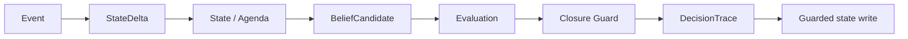

# Architecture

The runtime separates proposal, evaluation and commitment. A plausible `BeliefCandidate` never owns write authority. The evaluator may `ACCEPT`, `REJECT` or `HOLD`; only an accepted candidate produces a state write.

## First safeguard

`CM-GUARD-001` consumes a list of required child states. It is invariant to wording and child order. Unknown status values fail closed: they block parent completion rather than being silently treated as terminal.

## Shared contract

The runtime and LLM Evaluation Lab share `schemas/evaluation_case.schema.json`. The evaluation repository owns the case and metric; this repository owns the safeguard implementation and observable state transition.

