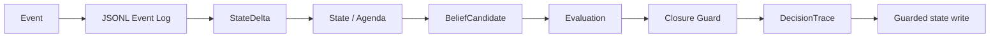

# Architecture

The runtime separates proposal, evaluation and commitment. A plausible `BeliefCandidate` never owns write authority. The evaluator may `ACCEPT`, `REJECT` or `HOLD`; only an accepted candidate produces a state write.

## Persistence and replay

`JsonlEventStore` validates and appends each accepted event before the runtime applies it. A new runtime can replay that log without appending it again, deterministically rebuilding processed-event identity, state, active agenda, deltas, and decision traces. Duplicate event IDs and malformed log records fail closed.

The current artifact is an executable local prototype, not a transactional database. JSONL keeps the event-sourcing contract observable while the project remains dependency-free.

## First safeguard

`CM-GUARD-001` consumes required child states supplied by the request or reconstructed from prior agenda events. It is invariant to wording and child order. Unknown status values fail closed: they block parent completion rather than being silently treated as terminal.

## Shared contract

The runtime and LLM Evaluation Lab share `schemas/evaluation_case.schema.json`. The evaluation repository owns the case and metric; this repository owns the safeguard implementation and observable state transition.
