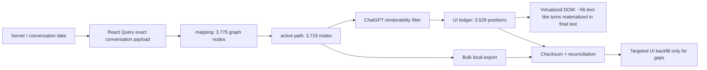

# Recovering a 6,394-page ChatGPT conversation without scrolling it

> **Engineering case study — read-only browser forensics, virtualized UI recovery, and evidence-first debugging**

A very long ChatGPT conversation appeared to require thousands of pages of UI scrolling to recover. The browser print preview estimated roughly **6,394 pages**, while individual long answers could take tens of seconds to materialize and distant jumps could take more than two minutes.

The investigation eventually showed that the visible DOM was not the conversation store. Only a small window of turns was materialized at any moment, while the browser application's in-memory conversation graph already contained the bulk message payload.

The recovery strategy therefore changed from:

```text
scroll everything → scrape visible DOM
```

to:

```text
read application state → export ordered graph → checksum
→ reconcile against UI turn ledger → backfill only gaps
```

This document records the reasoning path, failed hypotheses, quantitative checks, architecture model, and safety boundaries behind that transition.

**Implementation tracker:** [ENG-C2-RECOVERY-01 — Issue #10](https://github.com/aerenkolstein-code/Companion-Mind/issues/10)

> This case study describes browser internals observed during one ChatGPT Web session on 2026-08-17. These are not public OpenAI APIs or compatibility guarantees. Internal structures may change and any adapter must fail closed when its assumptions no longer hold.

---

## Result at a glance

| Observation | Measured result |
|---|---:|
| Print-preview scale | ~6,394 pages |
| Verified renderable-turn vector | 3,529 positions |
| Renderable composition | root 1 + user 1,764 + assistant 1,764 |
| Conversation `mapping` size | 3,775 graph nodes |
| Active path from `current_node` to root | 3,719 nodes |
| Message nodes on active path | 3,718 |
| Active-path roles | assistant 1,860 / user 1,779 / tool 79 |
| Text-like user/assistant nodes | 3,542 |
| Text-like nodes materialized in DOM during the final test | 56 |
| Offscreen text-like nodes | 3,486 |
| Offscreen nodes with non-empty `content.parts` | **3,486 / 3,486** |
| Offscreen nodes with empty `content.parts` | **0** |
| Offscreen nodes with direct string text | 3,456 |

The decisive finding was not merely that a conversation graph existed. It was that **all 3,486 currently offscreen text-like user/assistant nodes already had non-empty content payloads**.

That made bulk local recovery feasible without forcing every turn through the virtualized UI first.

---

## The problem

The original recovery plan was straightforward: scroll through the entire conversation, let each turn materialize, then capture the DOM.

That plan failed on cost.

Observed behavior included:

- sequential scrolling often waiting roughly **40–50 seconds** for a long answer to materialize;
- one distant random-access jump taking about **40 seconds**;
- another distant jump taking about **2 minutes 17 seconds**;
- materialization time varying with answer length;
- the page replacing DOM nodes as the virtualized viewport moved.

Even if the data were intact, a recovery mechanism proportional to all 3,529 renderable turns would be slow and fragile.

The real engineering question became:

> **Where is the conversation data before the UI turns it into visible DOM?**

---

## Investigation strategy

The investigation deliberately avoided starting with one large scraping script. Each step tested one narrow hypothesis with a read-only observation, count, shape check, or prototype check.

The sequence was:

```text
Network
→ virtualized DOM
→ stable turn identity
→ React Fiber / renderable vector
→ browser persistent storage
→ React Context
→ QueryClient
→ exact conversation cache entry
→ mapping + current_node
→ active-path traversal
→ offscreen body residency
```

The important discipline was **Source Before Conclusion**: a plausible story did not become an engineering fact until it had a measurable surface.

---

## Dead end 1 — Network traffic looked important, but was mostly telemetry

The first hypothesis was that distant navigation must trigger a message-body XHR/fetch response.

Network inspection repeatedly surfaced requests such as `m`, `t`, and `flush`.

Closer inspection changed the interpretation:

- one response returned only a success acknowledgement;
- `m` payloads matched analytics/metric-counter behavior;
- `t` payloads matched Segment-style tracking events;
- distant UI jumps could eventually render long answers without a corresponding large message-body response appearing in the observation window.

The lesson was twofold.

First, **a busy Network panel is not evidence that the target content is travelling in those requests**.

Second, request headers can contain sensitive authentication/session material. Headers were therefore explicitly excluded from the recovery evidence path. The recovery design does not copy cookies, authorization headers, CSRF material, or session tokens.

Network evidence did not prove that no backend source exists. It proved something narrower: the obvious requests in the observed path were not a reusable bulk conversation-body channel.

---

## Dead end 2 — The DOM contained thousands of shells

The Elements panel initially suggested that the conversation simply was not loaded. Many turn containers were effectively empty structural shells until they entered the materialized viewport.

A scan observed roughly **3,445 empty shells** at one point.

That turned out to be a virtualization artifact, not a data-absence proof.

The first important identity clue was a turn-container attribute of the form:

```html
data-turn-id-container="<UUID>"
```

Additional materialized-node surfaces included attributes such as:

```text
data-turn-id
data-turn
data-message-author-role
data-testid="conversation-turn-..."
```

This changed the problem from "scrape anonymous text" to "recover an ordered set of identity-bearing turns."

The DOM still remained unsuitable as the primary store because:

- virtualized nodes can be destroyed and recreated;
- the same logical turn can have shell/materialized representations;
- a selected DevTools `$0` node can lose its React Fiber when the page replaces it.

A robust adapter therefore cannot treat a DOM element reference as a durable conversation record.

---

## Breakthrough 1 — A complete renderable-turn ledger existed in React state

Following React Fiber and associated state exposed an ordered renderable-turn vector.

Its measured shape was:

```text
length = 3529
last index = 3528
root = 1
user = 1764
assistant = 1764
```

This was the first strong completeness ledger.

Before this point, "the conversation seems complete" was a visual impression. After this point, the UI layer had a machine-checkable expected count: **3,529 renderable positions**.

That number later became the reconciliation target rather than the bulk extraction source.

---

## Dead end 3 — Browser persistent storage had promising names but zero records

The Application panel exposed browser databases with names that looked highly relevant, including conversation/search-oriented stores.

Read-only inspection showed that the schemas existed, but the candidate stores contained **zero records**. Cache Storage also did not provide a populated conversation archive.

This resolved an important conceptual confusion:

> "The client has data" does not mean the historical conversation was previously stored on this computer's disk.

A conversation created largely on another device can still appear fully in the current desktop browser if the web application hydrates the conversation into its runtime state after opening it.

The persistent-storage result therefore redirected the search from "disk cache" to **live application state**.

---

## Breakthrough 2 — The shared React Query `QueryClient`

A React Context value exposed a small immediate prototype but a parent prototype with the characteristic TanStack / React Query `QueryClient` surface, including methods such as:

```text
getQueryData
getQueriesData
getQueryState
fetchQuery
refetchQueries
invalidateQueries
getQueryCache
getMutationCache
clear
```

The minified runtime constructor name was not treated as a contract. The method surface was the identity test.

Read-only query-cache inspection then found:

```text
total queries = 110
conversation/thread-related candidates = 9
```

Among them was a successful exact conversation entry shaped like:

```text
["conversation", <current-conversation-id>]
```

The successful entry's `state.data` was a substantial conversation payload rather than a thin status wrapper.

Two top-level fields were decisive:

```text
mapping
current_node
```

---

## Breakthrough 3 — The conversation graph

Shape inspection produced:

```text
mapping: Object, size = 3775
current_node: String
```

Following `parent` pointers from `current_node` back to root and reversing the path produced a chronological active path with:

```text
activePathNodes = 3719
messageNodes = 3718
noMessageNodes = 1
cycleDetected = false
```

Role counts were:

```text
assistant = 1860
user = 1779
tool = 79
```

This immediately explained why the graph and UI ledger were not expected to match 1:1.

The active path exceeded the 3,529-position UI vector by **190 nodes**, which decomposed exactly as:

```text
79 tool
+ 96 extra assistant
+ 15 extra user
= 190
```

The graph was therefore a strict superset of the renderable UI projection.

---

## A useful failed shortcut — `content_type` was not the full renderability rule

One tempting hypothesis was that ChatGPT's visible turns could be reproduced simply by filtering graph nodes by role and `content_type`.

The cross-tab disproved that.

For user nodes, every active-path user node was text-like, but the graph contained **1,779** users while the UI ledger contained **1,764**. Exactly **15 text-like user nodes** were filtered by some other rule.

On the assistant side, the simple text-like count also did not map exactly to the **1,764** renderable assistant turns.

So the exact UI renderability predicate remained partially unknown.

Crucially, that no longer blocked recovery. The strategy shifted from "perfectly reproduce the UI filter first" to "preserve the richer graph first, then reconcile."

---

## Decisive test — Are offscreen bodies already present?

The final uncertainty was whether the graph contained only metadata for offscreen nodes while message bodies remained lazy-loaded.

A read-only scan compared the ordered active-path nodes with the currently materialized DOM IDs and inspected only content shape/counts, not private message text.

Measured result:

```text
activePathNodes = 3719
textLikeUserAssistant = 3542
materializedNow = 56
offscreenTextLike = 3486
offscreenWithPayload = 3486
offscreenEmptyParts = 0
offscreenWithDirectText = 3456
```

By role:

```text
user offscreen = 1730
user with payload = 1730
user direct text = 1730

assistant offscreen = 1756
assistant with payload = 1756
assistant direct text = 1726
```

The remaining 30 assistant records still had structured, non-string parts. They were not empty bodies.

This was the recovery gate:

> **Only 56 text-like turns were materialized in the DOM, but all 3,486 offscreen text-like nodes already had non-empty payloads in application state.**

The bottleneck was primarily materialization/rendering, not body availability.

---

## Architecture model

The investigation separated four layers that initially looked like one thing.



The practical consequences are simple:

```text
not visible in DOM ≠ absent from application state
empty virtualized shell ≠ empty message body
empty IndexedDB ≠ empty JavaScript runtime state
UI turn ledger ≠ complete conversation graph
```

---

## Recovery design

The resulting prototype design is intentionally bulk-first and read-only.

### 1. Discover the live data source without minified-name assumptions

The adapter should:

- start from one currently materialized turn with a valid React Fiber handle;
- locate the shared QueryClient by behavioral/prototype shape;
- locate the successful exact conversation query;
- require `mapping` and `current_node` to exist;
- fail closed if any expected surface is missing or ambiguous.

### 2. Preserve the ordered active path

Starting at `current_node`, follow `parent` links to root, detect cycles/missing parents, reverse to chronological order, and preserve at least:

```text
path_index
node_id
parent_id
children_ids
message_id
role
content_type
create_time
content_parts
metadata
```

Structured/non-string parts must remain structured rather than being silently coerced into text.

### 3. Write an immutable local artifact

The first recovery artifact should be local JSON/JSONL with:

- conversation provenance metadata;
- graph and active-path counts;
- ordered node records;
- adapter/version marker;
- canonical SHA-256 checksum.

No remote upload is required for recovery.

### 4. Reconcile against the 3,529-turn UI ledger

The reconciler should classify records as:

```text
MATCHED
MISSING_FROM_BULK
EXTRA_GRAPH_NODE
AMBIGUOUS_MAPPING
```

Stable identity and ordering should dominate; text similarity is only a weak fallback.

### 5. Make slow UI work proportional to gap count

Only unresolved `MISSING_FROM_BULK` or `AMBIGUOUS_MAPPING` entries should require sidebar/random-access materialization.

This changes the operational cost from roughly:

```text
O(all turns × UI wait)
```

to:

```text
O(bulk local traversal) + O(gaps × UI wait)
```

---

## Safety and privacy boundary

The recovered payload may contain private conversation content. The public repository therefore contains only structural evidence and synthetic fixtures.

The recovery path must not:

- export or log cookies, authorization headers, CSRF values, or session tokens;
- depend on copied browser credentials;
- call QueryClient mutation methods such as `setQueryData`, `removeQueries`, `resetQueries`, `invalidateQueries`, or `clear`;
- use hidden bulk backend requests as a download mechanism;
- upload recovered conversation bodies to GitHub, CI artifacts, or external services;
- publish private conversation IDs when avoidable;
- treat an internal ChatGPT Web object layout as a stable public API.

Public validation should report counts, checksums, state transitions, and typed failures — not recovered private bodies.

---

## Why the dead ends mattered

The failed hypotheses were not wasted work. Each one removed a class of unsafe or fragile implementation assumptions.

| Hypothesis | Test | Result | Design consequence |
|---|---|---|---|
| The visible XHRs contain conversation bodies | inspect payload/response | mostly telemetry/acknowledgement | do not build on those requests |
| Empty DOM shell means missing message | compare virtualized DOM vs later materialization | false | DOM is a projection, not authority |
| Conversation database name implies local history | count IndexedDB records | zero | schema presence is not data presence |
| `content_type` alone reproduces visible turns | role × type reconciliation | mismatch | preserve graph first; filter later |
| One selected Fiber node is durable | navigate/virtualize | node may be replaced | rediscover and validate live handles |
| Offscreen graph nodes may be metadata-only | inspect `content.parts` shape/count | 3,486/3,486 populated | bulk recovery gate passes |

The recurring method was:

> **Form a small hypothesis, design a read-only falsification test, record a number or structural fact, and only then make the next architectural claim.**

---

## Evidence boundaries and limitations

### Established in the observed session

- an ordered 3,529-position renderable-turn vector existed;
- a React Query `QueryClient`-compatible shared context was reachable;
- a successful exact conversation query exposed `mapping` and `current_node`;
- `mapping` contained 3,775 nodes;
- the active parent path contained 3,719 nodes without a detected cycle;
- 3,486 currently offscreen text-like nodes all had non-empty payloads;
- the bulk-first recovery design was therefore feasible in principle.

### Not yet established by this case study alone

- a production-quality exporter has not yet been accepted;
- the exact 3,719 ↔ 3,529 reconciliation has not yet been automated end to end;
- the complete ChatGPT renderability predicate is not known;
- future ChatGPT Web builds may reorganize React state or query keys;
- this work does not expose or claim a supported OpenAI API for consumer ChatGPT history.

Implementation and synthetic tests are tracked in [Issue #10](https://github.com/aerenkolstein-code/Companion-Mind/issues/10).

---

## What this demonstrates

The most reusable result is not a particular internal property name. It is the debugging pattern.

A seemingly impossible UI-recovery problem became tractable after separating:

```text
transport
persistent storage
application state
UI projection
```

and after refusing to equate "not currently visible" with "not present."

The final recovery principle is:

> **Preserve the richer graph first. Reconcile presentation later. Make the slow path proportional only to the gaps.**
