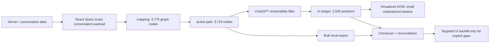

# Recovering a 6,394-page ChatGPT conversation without scrolling it

> **Engineering case study — read-only browser forensics, virtualized UI recovery, and evidence-first debugging**

**Status:** accepted bounded prototype merged to `main`.  
**Tracker:** [ENG-C2-RECOVERY-01 — Issue #10](https://github.com/aerenkolstein-code/Companion-Mind/issues/10) — **completed**.  
**Implementation:** [PR #15](https://github.com/aerenkolstein-code/Companion-Mind/pull/15) — merged as `f2ccf2476cc67a391f19e6e290edc8d43abd4531`.

> This case study describes browser internals observed during one ChatGPT Web session on 2026-08-17. These are not public OpenAI APIs or compatibility guarantees. Internal structures may change; the adapter therefore fails closed when required surfaces cannot be identified confidently.

## Outcome

A very long ChatGPT conversation appeared to require thousands of pages of UI scrolling to recover. Chrome print preview estimated roughly **6,394 pages**, while the virtualized UI could take tens of seconds or more than two minutes to materialize distant long answers.

The key finding was that the visible DOM was only a projection. The browser application's in-memory conversation graph already contained the bulk message payload before the corresponding turns were materialized on screen.

The recovery path therefore changed from:

```text
scroll everything → scrape visible DOM
```

to:

```text
read application state
→ export ordered active graph locally
→ deterministic checksum
→ reconcile against the verified UI ledger
→ use slow UI materialization only for explicit residual gaps
```

That design was implemented and accepted as a bounded read-only prototype.

## Evidence that unlocked the prototype

| Observation | Measured result |
|---|---:|
| Print-preview scale | ~6,394 pages |
| Verified renderable-turn ledger | 3,529 positions |
| Renderable composition | root 1 + user 1,764 + assistant 1,764 |
| Conversation `mapping` size | 3,775 graph nodes |
| Active path from `current_node` to root | 3,719 nodes |
| Message nodes on active path | 3,718 |
| Active-path roles | assistant 1,860 / user 1,779 / tool 79 |
| Text-like user/assistant nodes | 3,542 |
| Text-like turns materialized in DOM during final residency test | 56 |
| Offscreen text-like nodes | 3,486 |
| Offscreen nodes with non-empty `content.parts` | **3,486 / 3,486** |
| Offscreen nodes with empty `content.parts` | **0** |

The decisive gate was simple:

> **Only 56 text-like turns were materialized in the DOM, but all 3,486 offscreen text-like nodes already had non-empty payloads in application state.**

The bottleneck was therefore primarily UI materialization, not body availability.

## Data path discovered

The investigation separated layers that initially looked like one thing:



The practical lessons were:

```text
not visible in DOM ≠ absent from application state
empty virtualized shell ≠ empty message body
empty IndexedDB ≠ empty JavaScript runtime state
UI turn ledger ≠ complete conversation graph
```

## Accepted implementation

PR #15 implemented the bounded prototype with two complementary surfaces.

### Browser-side read-only exporter

`tools/chatgpt_recovery_exporter.js`:

- starts from a currently materialized turn with a valid React Fiber handle;
- identifies a React Query-compatible `QueryClient` by method shape rather than minified constructor name;
- locates the successful exact conversation query containing `mapping` and `current_node`;
- reconstructs the `current_node` parent chain in chronological order;
- preserves root/no-message, user, assistant, tool, and structured payload records;
- computes a deterministic local SHA-256;
- uses a local Blob download path;
- performs no fetch/XHR bulk recovery and calls no QueryClient mutation method;
- fails closed when required browser surfaces are missing or ambiguous.

### Verifier and reconciler

`companion_mind/chatgpt_recovery.py` plus browser/Node helpers:

- validates active-path structure and fails closed on malformed/cyclic ancestry;
- verifies deterministic artifact canonicalization and checksum;
- exports a metadata-only renderable ledger;
- reconciles by role + timestamp + monotonic order without requiring text similarity;
- classifies `MATCHED / MISSING_FROM_BULK / EXTRA_GRAPH_NODE / AMBIGUOUS_MAPPING`;
- emits an explicit machine-readable gap ledger;
- scans for credential/header-shaped surfaces.

The repository tests use synthetic public-safe fixtures only.

## Final accepted validation

The accepted live/local receipt on the target conversation was:

| Metric | Final result |
|---|---:|
| Mapping size | 3,775 |
| Active path size | 3,719 |
| Renderable ledger | 3,529 |
| `MATCHED` | 3,523 |
| `MISSING_FROM_BULK` | 5 |
| `EXTRA_GRAPH_NODE` | 196 |
| `AMBIGUOUS_MAPPING` | 1 |
| Unresolved gap count | **6** |
| Credential-shaped surfaces | 0 |
| QueryClient mutation calls | 0 |
| Network requests required for bulk path | 0 |

The exact-browser-JS recovery artifact checksum was:

```text
941f3680bbec035df3b33ed4ca179d9eb0ec1390f78763daa58632a246156966
```

The final reconciliation and gap-ledger checksums were:

```text
reconciliation: 546bb25026f7dfb2b2787216fe9247eecb0c1057ca9570d60a005a8494505f7c
gap ledger:     3c77786cfe5be07c9728c5a16bd8a816a33415b6c6d6cc07d60ed94ebbb58073
```

CI was GREEN on accepted head `968422c0b9e9106eb4bee15f998c5c488f0e14a4` (Actions Test #97 SUCCESS).

Zero gaps were deliberately **not** an acceptance requirement. The first-prototype target was:

> **Recover the bulk safely, identify every residual gap explicitly, and make the slow UI path proportional only to the gap count.**

That gate passed. The remaining **5 missing + 1 ambiguous** items remain explicit known residuals and were not automatically backfilled.

## Safety and privacy boundary

The recovered payload may contain private conversation content. The public implementation therefore preserves strict boundaries:

- no recovered private conversation bodies are committed;
- no cookies, Authorization headers, CSRF values, session tokens, or copied browser credentials are exported;
- no QueryClient mutation method is used;
- no hidden backend bulk-download path is used;
- no recovered body data is uploaded to GitHub, CI artifacts, or external services;
- public fixtures are synthetic;
- public receipts report counts, hashes, typed failures, and structural states rather than private message text.

Formal ingestion of recovered private content into Canonical RAW/L0/Drive was outside Issue #10 and was not authorized by the prototype merge.

## What remains deliberately unclaimed

The accepted result is a **bounded read-only prototype**, not a production integration. It does not claim:

- a production-quality or vendor-supported ChatGPT history API;
- compatibility with future ChatGPT Web builds;
- knowledge of the complete ChatGPT renderability predicate;
- zero unresolved reconciliation gaps;
- automatic targeted backfill of the residual 5 + 1 items;
- production deployment or enterprise-grade reliability;
- ingestion of private recovered conversation bodies into public or canonical archives.

Future browser builds may reorganize React state, query keys, or internal object shapes; the adapter must fail closed rather than guess.

## Why the failed hypotheses mattered

The investigation deliberately tested and rejected several tempting shortcuts before implementation:

- visible XHR/fetch traffic was mostly telemetry/acknowledgement in the observed path;
- thousands of empty DOM shells were virtualization artifacts, not proof of missing bodies;
- promising browser database names existed while candidate stores contained zero records;
- `content_type` alone did not reproduce the UI's renderability rule;
- one selected Fiber node was not a durable record because virtualization could replace it.

Those dead ends removed unsafe or fragile assumptions and led to the more reusable debugging rule:

> **Form a small hypothesis, design a read-only falsification test, record a structural fact or number, and only then make the next architectural claim.**

## Historical investigation record

The original 519-line pre-implementation forensic write-up is preserved separately rather than silently rewritten after the prototype succeeded:

[Read the original investigation notes](chatgpt-long-conversation-recovery-investigation-notes.md)

That document records the discovery path and the pre-implementation limitations as they were understood before PR #15 was accepted. This page is the current post-implementation case study and should be used for current status claims.

## Final principle

A seemingly impossible UI-recovery problem became tractable after separating:

```text
transport
persistent storage
application state
UI projection
```

and refusing to equate "not currently visible" with "not present."

> **Preserve the richer graph first. Reconcile presentation later. Make the slow path proportional only to the gaps.**
